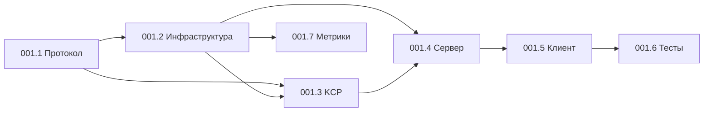

# TASK-001: Обзор подзадач NetChannel

## Статус реализации

| ID | Подзадача | Статус | Прогресс | Блокеры |
|----|-----------|--------|----------|---------|
| 001.1 | Подготовка протокола | 🔴 New | 0% | - |
| 001.2 | Базовая инфраструктура | 🟡 Partial | 30% | - |
| 001.3 | KCP реализация | 🟡 Partial | 40% | 001.1 |
| 001.4 | Серверная интеграция | 🟡 Started | 20% | 001.1, 001.2 |
| 001.5 | Клиентская реализация | 🔴 New | 0% | 001.1-001.4 |
| 001.6 | Тестирование | 🔴 New | 0% | 001.1-001.5 |
| 001.7 | Мониторинг и отладка | 🔴 New | 0% | 001.2 |

## Критический путь



## Приоритеты на текущий момент

### 🔥 Срочно (блокирует остальное)
1. **TASK-001.1**: Рефакторинг протокола
   - Критично для всей системы
   - Блокирует интеграцию
   - ~8 часов работы

### ⚡ Важно (можно делать параллельно)
2. **TASK-001.2**: Завершить инфраструктуру
   - Channel Manager
   - Message Serializer
   - ~3 часа работы

3. **TASK-001.7**: Базовые метрики
   - Можно начать параллельно
   - Нужно для отладки
   - ~6 часов работы

### 📋 Следующие шаги
4. **TASK-001.3**: Доработать KCP
5. **TASK-001.4**: Интеграция с сервером
6. **TASK-001.5**: Клиентская часть
7. **TASK-001.6**: Полное тестирование

## Ресурсы и зависимости

### Внешние библиотеки
- ✅ `github.com/xtaci/kcp-go` - уже добавлена
- ❌ `github.com/HdrHistogram/hdrhistogram-go` - для метрик
- ❌ `github.com/klauspost/compress/zstd` - компрессия
- ❌ `github.com/hashicorp/golang-lru` - кеширование

### Команда для установки:
```bash
go get github.com/HdrHistogram/hdrhistogram-go
go get github.com/klauspost/compress/zstd
go get github.com/hashicorp/golang-lru/v2
```

## Риски и проблемы

### 🚨 Высокий риск
1. **Несовместимость протокола**
   - Сломаем существующих клиентов
   - Нужна стратегия миграции

2. **Производительность KCP**
   - Может быть хуже TCP на хороших сетях
   - Нужны benchmarks

### ⚠️ Средний риск
3. **Сложность отладки UDP**
   - Нужны хорошие инструменты
   - Детальное логирование

4. **Масштабирование**
   - 5000 соединений - амбициозная цель
   - Нужно тестирование под нагрузкой

## Метрики успеха

- [ ] Latency P99 < 100ms при 5% packet loss
- [ ] Throughput > 10MB/s на соединение
- [ ] CPU usage < 50% при 5000 игроков
- [ ] Memory < 100MB на 1000 соединений
- [ ] Reconnect time < 1s

## Рекомендации

### Вариант A: Полная реализация (рекомендуется)
1. Начать с TASK-001.1 немедленно
2. Параллельно завершить 001.2 и 001.7
3. Итеративно дорабатывать остальное
4. **Время**: ~70 часов

### Вариант B: MVP для тестирования
1. Упрощённый протокол (без full refactoring)
2. Базовый KCP без оптимизаций
3. Тестирование на малой нагрузке
4. **Время**: ~30 часов

### Вариант C: Альтернативные решения
1. Использовать готовое решение (например, Mirror Networking)
2. Остаться на TCP+UDP но оптимизировать
3. Перейти на WebRTC DataChannels
4. **Время**: ~20 часов исследований

## Следующие действия

1. **Принять решение**: Полная реализация или MVP?
2. **Начать с протокола**: TASK-001.1 критична
3. **Подготовить окружение**: Установить зависимости
4. **Создать ветку**: `feature/netchannel-implementation`

---

*Обновлено: 2025-06-21* 